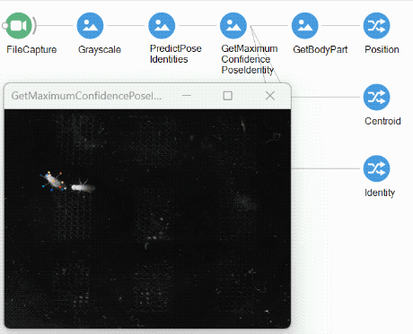

# Bonsai - SLEAP

`Bonsai.Sleap` is a [Bonsai](https://bonsai-rx.org/) interface for [SLEAP-NN](https://nn.sleap.ai/) allowing multi-animal, real-time, pose and identity estimation using pretrained network models stored in the [ONNX format](https://onnx.ai/).

`Bonsai.Sleap` loads `.onnx` files using the [ONNX Runtime](https://onnxruntime.ai/), which provides a .NET API allowing native inference using either the CPU or GPU (supporting both CUDA and TensorRT). By exporting a SLEAP-NN model in the `.onnx` format, you can leverage all the `Predict` operators from `Bonsai.Sleap` to run a live image stream through the inference network and extract a sequence of identified poses for real-time tracking of both object identities and body part positions. You can then use this data stream to drive online effectors or simply save the results to an output file.

`Bonsai.Sleap` came about following a fruitful discussion with the SLEAP team during the [Quantitative Approaches to Behaviour](http://cajal-training.org/on-site/qab2022).

## How to install

`Bonsai.Sleap` can be downloaded through the Bonsai package manager. In order to enable visualizer support, you should download both the `Bonsai.Sleap` and `Bonsai.Sleap.Design` packages.

To use GPU inference (highly recommended for live inference), you also need to install the `CUDA Toolkit` and `cuDNN`. The current package backend was developed and tested against CUDA 12.9 and cuDNN 9.19, but other versions should also be compatible. You can find installation instructions for different versions of CUDA and cuDNN at the [CUDA Toolkit Archive](https://developer.nvidia.com/cuda-toolkit-archive) and the [cuDNN Archive](https://developer.nvidia.com/cudnn-archive).

For optimized inference using TensorRT you need to further download the [TensorRT SDK](https://developer.nvidia.com/tensorrt). The current backend was found to run successfully on TensorRT 10, but other versions should also be compatible. Make sure to add the `bin` folder of your TensorRT download to the `PATH` environment variable, or copy all DLL files to the `Extensions` folder.

## How to use

`Bonsai.Sleap` currently supports the following SLEAP-NN networks through the correspondent Bonsai operator:

 - `centroid`:
   - Input : full frame with potentially multiple objects
   - Output : collection of multiple detected centroids in the input image
   - Operator : `PredictCentroids`
 - `topdown`:
   - Input : full frame with potentially multiple objects
   - Output : collection of detected poses (centroid + body parts) from multiple objects in the image
   - Operator : `PredictPoses`
 - `multi_class_topdown_combined`:
   - Input : full frame with potentially multiple objects
   - Output : collection of detected poses (centroid + body parts) plus identities from multiple objects in the image
   - Operator : `PredictPoseIdentities`
 - `single_instance`:
   - Input : croped instance with a single object in the input image
   - Output : returns a single pose (body parts)
   - Operator : `PredictSinglePose`

The general Bonsai workflow will thus be:

Additional information can be extracted by selecting the relevant structure fields.

In order to use the `Predict` operators, you will need to provide the `ModelFileName` of the exported `.onnx` file containing your exported SLEAP-NN model. Make sure the `export_metadata.json` file is located in the same folder as the exported `.onnx` file.

If everything works out, your poses should start streaming through! The first frame will cold start the inference graph which may take a few seconds to initialize, especially when using GPU inference with CUDA or TensorRT for the first time.

> [!NOTE]
> The TensorRT execution provider compiles a whole new module targeting the TensorRT engine specific for your GPU. This engine is cached by default in the `.bonsai/onnx` folder so subsequent runs should start much faster.

## Exporting SLEAP-NN models

For all questions regarding exporting SLEAP-NN models, please check the official [docs](https://nn.sleap.ai/latest/guides/export/).
