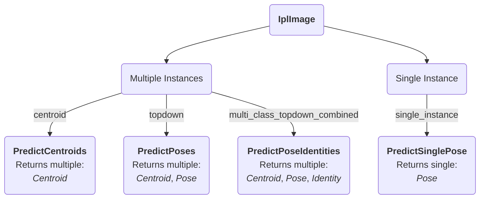

How to use
==========

`Bonsai.Sleap` currently implements real-time inference on four distinct SLEAP-NN networks through their corresponding Bonsai `Predict` operators.

In order to use the `Predict` operators, you will need to provide the `ModelFileName` of the exported `.onnx` file containing your exported SLEAP-NN model. Make sure the `export_metadata.json` file is located in the same folder as the exported `.onnx` file.

[!include[Introduction](~/articles/sleap-intro.md)]

Working examples for each of these operators can be found in the extended descriptions, which we cover below.

## PredictCentroids
[!include[PredictCentroids](~/articles/sleap-predictcentroids.md)]

## PredictPoses
[!include[PredictPoses](~/articles/sleap-predictposes.md)]

## PredictPoseIdentities
[!include[PredictPoseIdentities](~/articles/sleap-predictposeidentities.md)]

## PredictSinglePose
[!include[PredictSinglePose](~/articles/sleap-predictsinglepose.md)]